<h1 align="center">LojaChocolateApp</h1>
<h1 align="center">

</h1> 

Este projeto faz parte de um estudo prático da linguagem Csharp, com uso da .NET Framework,  WinForm e MS SQL Server.
A aplicação tem como função gerir necessidades básicas de uma pequena loja de chocolates, onde deseja-se um controle de funcionário, produtos e vendas.
 

<a href="#sobre"><b>Sobre</b></a> •
<a href="#features"><b>Features</b></a> •
<a href="#tecnologias"><b>Tecnologias</b></a> •
<a href="#pré-requisitos"><b>Pré-Requisitos</b></a> •
<a href="#autor"><b>Autor</b></a> 

 

# **Sobre**

O formato de exibição deste aplicativo tem tamanho único não possibilitando sua redução ou aumento, o design é pensado para ser objetivo com suas informações apresentadas.

A App usa como repositório um banco de dados SQL que através das classes <b>FuncionarioRepository</b>, <b>ProdutoRepository</b> e <b>VendasRepository</b> são manipulados os dados que serão gravados, alterados ou removidos.

Todas as classes de repositório implementam a interface <b>IRepository</b> onde a base de métodos está atribuída.
 

As classes que intermediam a manipulação dos objetos que serão produtos, vendas e funcionários gerem os seus atributos que serão gravados nos respectivos repositórios. 

Em futuras versões serão adicionadas funcionalidades que possibilitem o cálculo de bonificação, controle de usuário através de login e implementação de banco de dados SQL
 

# **Features**

<h2><b>Login</b></h2>

Escolha a instancia SQL que devera utilizar o banco de dados, informe usuário e senha para acessar o sistema.

<h1 align="center">  
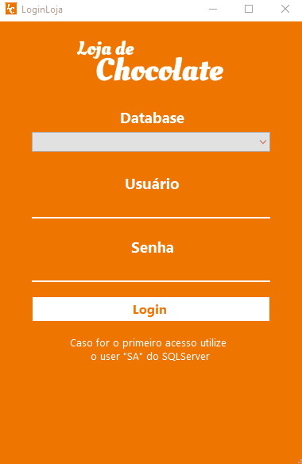
</h1>  
<h2><b>Menu</b></h2>

O menu é interativo com dropDown para seus submenus, os submenus controlam qual tela vai aparecer para o usuário.

 
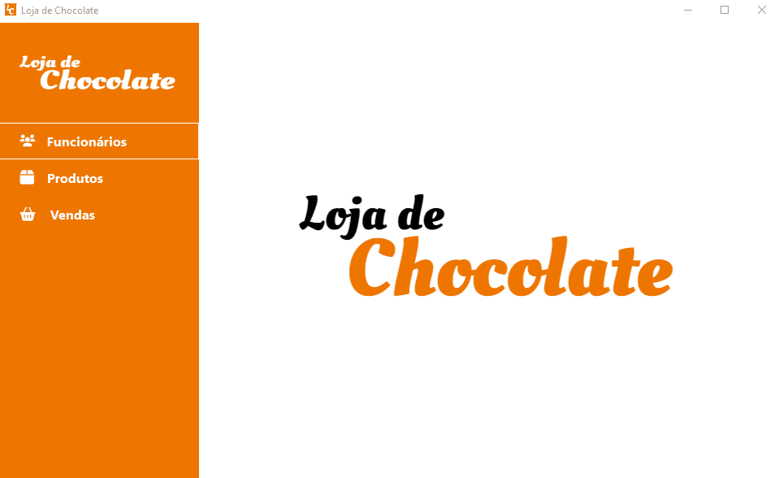
  
<h2><b>TextBox</b></h2>

Utiliza-se de textbox para inserção de dados onde os campos são configurados para recuperar as informações de forma correta.

Os campos Id, Estoque, contato, salário entre outros aceitam apenas valores numéricos os mesmos tem um limite de caracteres e são configurados quando necessário

 
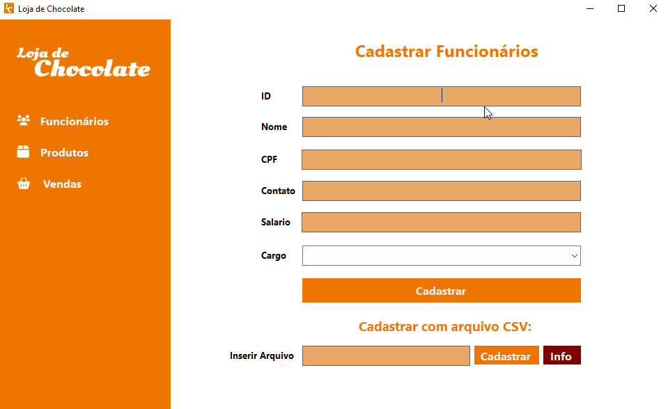
  
<h2><b>CSV no Cadastro</b></h2>

Ao enviar um arquivo CSV a aplicação analisa os padrões do texto retornando um erro caso o mesmo esteja fora dos padrões. Para facilitar o usuário foi inserida um popup que informa quais padrões devem ser seguidos.

 
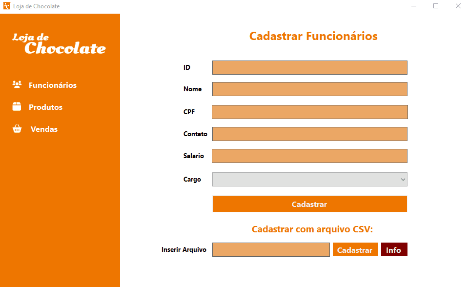
  
<h2><b><b>Remover Produto ou Funcionário</b></b></h2>

Ao tentar remover um produto ou funcionário será exibido um popup de aviso para que seja confirmada a decisão de remoção do mesmo.

 
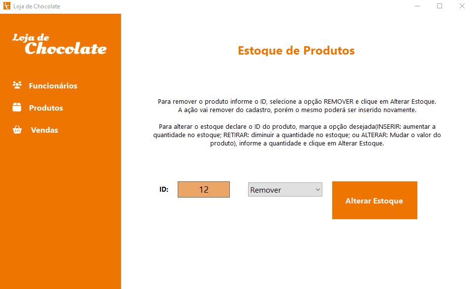
  
<h2><b>Exibição das informações cadastradas</b></h2>

A exibição de produtos e funcionários e seus detalhes é feita através do uso de painéis criadas por control form.
 
<h1>
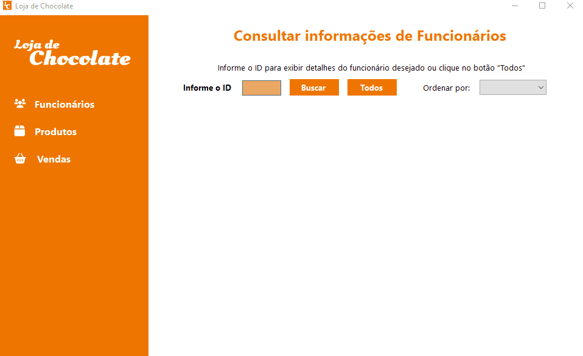
</h1> 

Já a exibição de vendas é feita através de DataGrid.

 
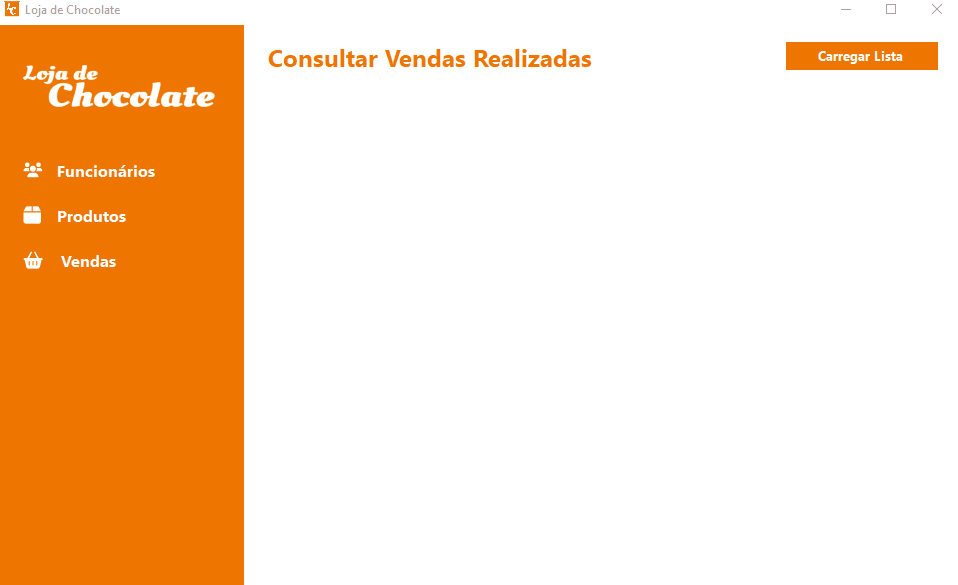
  
<h2><b>Erros Esperados</b></h2>

Alguns erros comuns são esperados e serão informados através de <b>MessageBox</b>. Alguns deles são:

<h3><b>Dados faltantes e incorretos no TextBox:</b></h3>
 
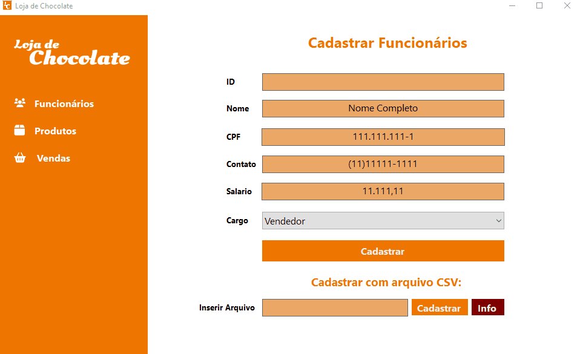
  

Mais erros são esperados como: id incorreto em busca de detalhes; produto com pouco estoque; CSV incorreto, entre outros

 
<h2><b>Cadastro de Novo Usuário</b></h2>

Incluido a possibilidade de criar um novo acesso mediante a aprovação de um gerente.
 
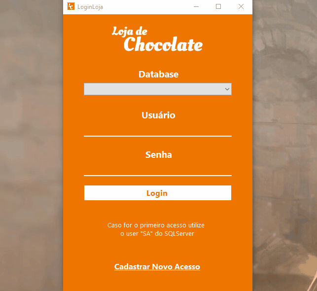
 
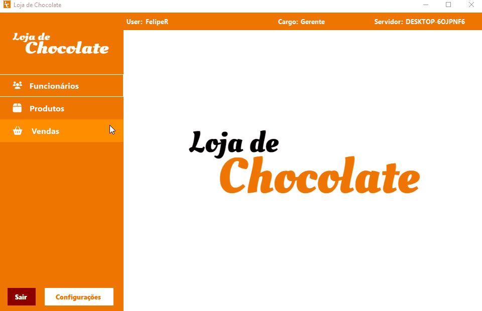
  
<h2><b>Controle de Acesso de Usuários</b></h2>

Habilitada a possibilidade de diferentes views para cada hierarquia de funcionário. O usuário <b>"Gerente"</b> terá acesso a todas as funções da aplicação inclusive a de aprovar novo login, já o vendedor não tera acesso ao menu de funcionários.
 
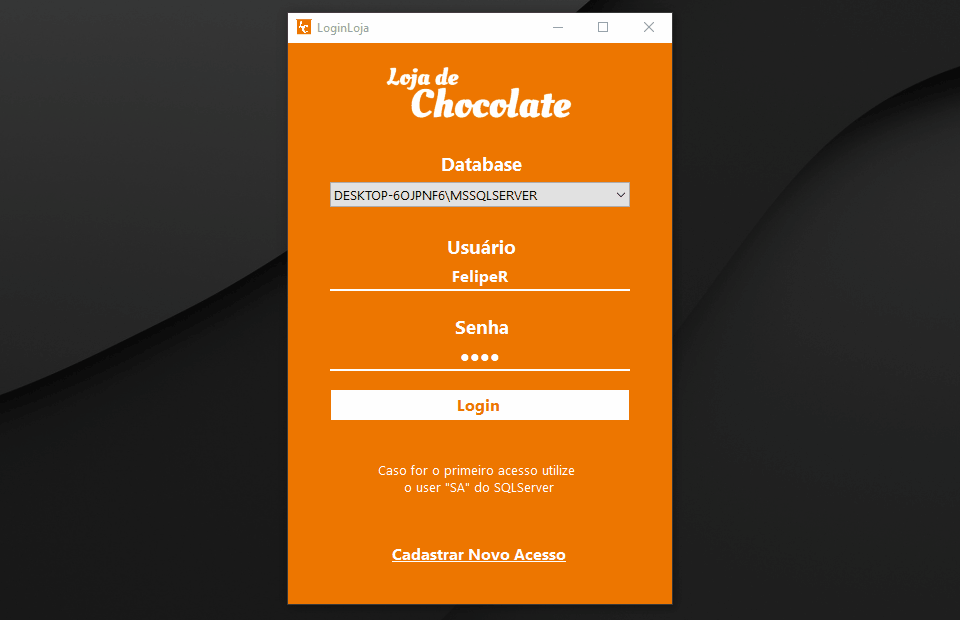
  
<h2><b>DarkMode e viso de Estoque Baixo</b></h2>

A funcionalidade de darkmode altera o fundo de painéis que são brancos, substituíndo a cor por um cinza próximo ao preto, além disso as fontes são alteradas para a cor branca. O aviso de estoque baixo informa o usuário se o estoque de um produto está abaixo do escolhido.
 
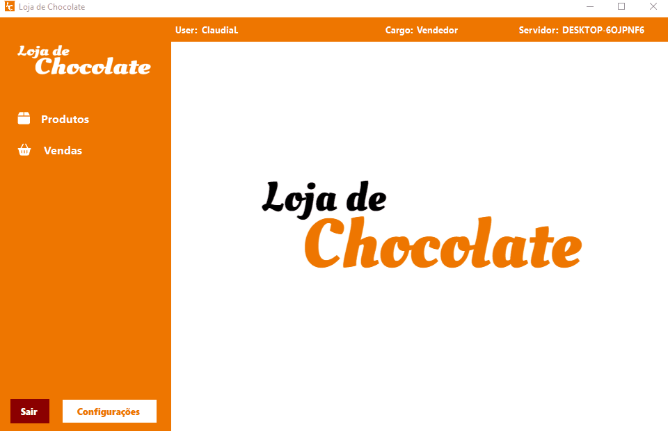
  

# **Tecnologias**

- **`CSharp`**
- **`.NET Framework 4.8`**
- **`SQL Server Microsoft`**

Através da linguagem CSharp, FrameWork .NET e o WinForms foram aplicadas tecnologias para captura de erro como try/Catch, verificação de padrões em textos com a classe Regex, implementação de diferentes formas de ordenar objetos com a interface ICompare.

Para o uso do repositório foi aplicado o banco de dados MS SQL SERVER 2019 com tabelas para Funcionário, Produtos e Vendas e scripts utilizados para busca e escrita. Através do SQL também foi implementado um sistema de login que usa como user o próprio usuário cadastrado na criação do SQL Server.

De forma a utilizar uma escrita de códigos com menos linhas e métodos o uso de Tuple para retornar mais de um valor em um método foi aplicado. O mesmo também foi utilizado em lista de correlação de valores com objetos.

Por fim, muitas funções de click time event foram aplicadas para que o funcionamento correto e responsividade visual fossem obtidas na aplicação.
 

# **Pré-Requisitos**

Para garantir o funcionamento da aplicação deve-se extrair o arquivo na raiz do disco C: ou em outro disco.

Será necessária a instalação do MS SQL Server 2019, seguindo o passo a passo abaixo. O download está no link a seguir: https://www.microsoft.com/pt-br/sql-server/sql-server-downloads

Obs.: A versão utilizada no projeto foi a "Developer".

<h3><b>Processo de Instalação MS SQL SERVER 2019</b></h3>

Primeiramente inicie a instalação de modo personalizado e após isso em instalação selecione a primeira opção "Criar nova instalação autônoma do SQL".

Avance até a opção de "Seleção de Recursos" e marque a primeira box. Após isso siga até a opção de "Configuração de Mecanismo de Banco de Dados", selecione o modo misto, coloque a senha de sua preferência e adicione seu usuário de windows como um dos administradores."

Agora basta apenas finalizar a instalação.
 
<h3><b>Permissão de Usuário</b></h3>

Para que o banco de dados da aplicação fique funcional é necessário dar permissão de usuário no arquivo conforme segue:

Acesse o caminho "LojaChocolateApp\LojaChocolateAppView\LojaChocolateApp\Database" e para ambos os arquivos da pasta clique com o botão direito e vá em propriedades.

Em propriedades acesse a aba segurança e clique em editar, para editar permissões do "SISTEMA" e conceda "Controle Total".

Após isso basta apenas finalizar a instalação e utilizar a aplicação.

Para utilizar a aplicação basta salva-la em seu computador e utilizar seu atalho.

Caso ocorra algum problema ao acessar o atalho deve acessar o seguinte diretório:  LojaChocolateAppView/LojaChocolateApp/bin/Debug/LojaChocolateApp.exe
 

# Autor

| [ Felipe Rodrigues Santos](https://github.com/FelipeR-S) |  
| :---: |